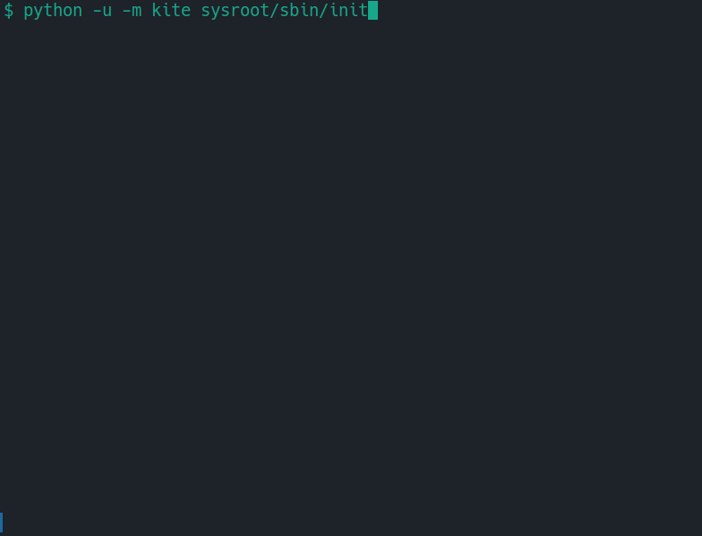

# Welcome to Kite - a floating kernel

Kite is a Python program that implements the functionality of a Unix kernel. It serves as an operating system for userspace processes executed on a CPU simulator. It is capable or running full userspace environment, including shell and utils, taken from [mimiker][1] project:



`kite` supports two CPU simulators:
* [Unicorn Engine][2], used by default, which is able to run full userspace. It supports many architecutres, including RISCV64 and RISCV32 used in this project.
* Patched version of [PyRISC simulator][3], simple simulator with limited capabilities, but great for experimenting with small programs. It supports only RISCV32 binaries.

This project is intended for educational and research purposes. Its goal is to provide a high-level, conceptual understanding of what an operating system kernel does. It allows us to forget that the kernel is also a binary program, that must somehow take care of its resources. We can instead focus on the control flow in the operating system. The codebase is small, the entire `kite` project consists of _fewer than 3K_ lines of Python code.

## What kite can do

`kite` can run full userspace environment taken from [mimiker][1] project (we compiled it for RISCV64), which inscludes [sinit][5], NetBSD's [Korn Shell][4], so you can have a real interactive session where you can use tools such as `ls`, `cd`, `grep`, `sed` and Lua language interpreter (with floating point instructions). This demonstrates that `kite` can:
* manage multiple user processes
* manage virtual memory address space for each process
* dynamically allocate memory for user processes
* deliver signals between processes
* support terminal session to such extent to allow interaction via stdin/stdout, handle special characters like `^Z`,`^C`
* support woking with files
* support job control, pipes, moving between foreground and background jobs, reparenting.

## Possible future work

* Support compiling new programs to run under `mimiker` userspace
* Support full terminal functionality. It would be great to be able to use a text editor under kite.
* Support syscall failing (current implementation is limited, e.g. `errno` is not set)
* Extend syscall support to be able to run more userspace programs (e.g. running Python interpreter would be impressive)
* Introduce abstraction for VFS

# Installation

`kite` project consists of kite source code and a `pyrisc` submodule - a RISC-V cpu simulator. Clone the repo recursively:
```
git clone --recursive https://github.com/Dawid-Sroka/kite.git
cd kite
```
`kite` and `pyrisc` are imported as python packages. To use them easily, create a virtual environment and install the dependecies:
```
python -m venv .venv
source .venv/bin/activate
pip install -r requirements.txt
```
You can get the compiled sources of [mimiker][1] by running the script:
```
./get_kite_binaries.sh
```

# Running Kite

`kite` can run binary user programs compiled for RISC-V. The `programs` directory contains example programs written in C and a minimal library.

```
python -u -m kite path/to/example_program
```
This launches Kite operating system and passes `example_program` as the first userspace program.
For the full userspace demo run (login and password is _root_):
```
python -u -m kite sysroot/sbin/init
```
## Specifying simulator

By default, `kite` uses [Unicorn Engine][2] as simulator. You can specify [PyRISC simulator][3] with `--simulator` option:

```
python -u -m kite path/to/example_program --simulator pyrisc
```

# Testing

For running tests, install `expect`.

Execute `test` script to run all tests:

```
./test
```

Test cases can be run separately, e.g.:

```
./tests/simply_exit unicorn
```

# Compiling userspace programs

`kite` project currently supports compiling userspace programs linked with a minimal C library (not with the `mimiker` userspace). For this, RiscV compilator is needed. Usually (e.g. in Ubuntu) it can be obtained by downloading the package with a name `gcc-riscv64-linux-gnu`.
```
apt install riscv64-linux-gnu-gcc
```
Then you should be able to compile your own userspace programs using the Makefile provided in the project:
```
(cd programs && make)
```
This will compile RV64 binaries (compatible with Unicorn emulator). To compile RV32 binaries (compatible with PyRISC emulator) please run:
```
(cd programs && make ARCH=rv32)
```
This will compile all provided programs, link them with the library provided in the project and produce executables in the `binaries` directory. To use them, run e.g:

```
python -u -m kite binaries/piping
```
If using PyRISC, specify the emulator:
```
python -u -m kite binaries/piping --simulator pyrisc
```

[1]: https://github.com/cahirwpz/mimiker
[2]: https://github.com/unicorn-engine/unicorn
[3]: https://github.com/Dawid-Sroka/pyrisc
[4]: https://man.netbsd.org/ksh.1
[5]: https://core.suckless.org/sinit
